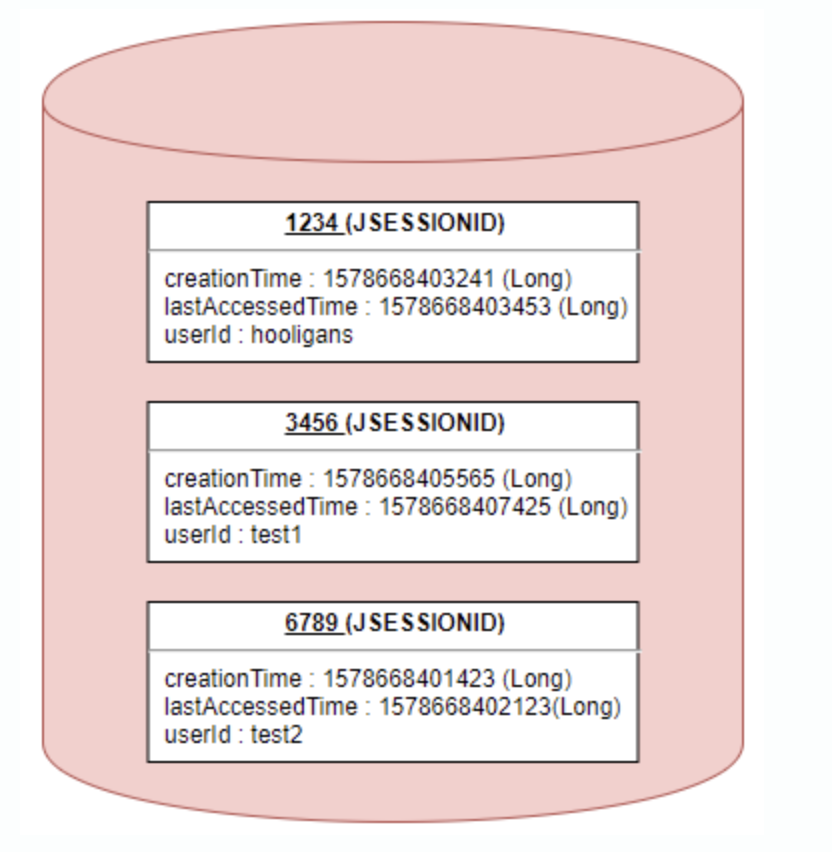
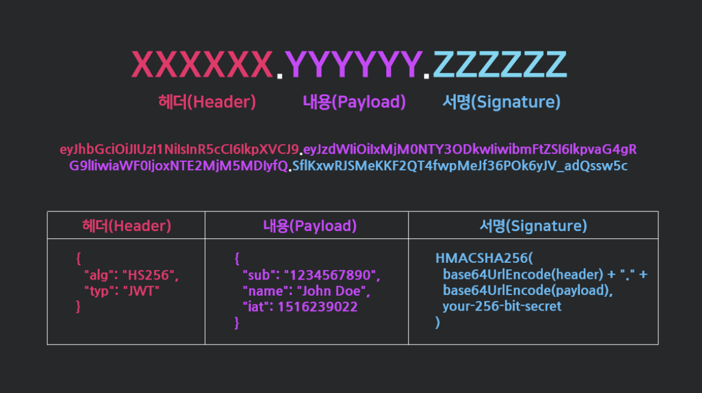

# 쿠키와 세션, JWT 토큰

# (내가 만든) Cookie 🍪

- **Key-Value** 형식의 문자열 덩어리
- **cookie를 이용해서 서버는 브라우저에 데이터 저장 가능**
- 클라이언트가 웹사이트를 방문할 경우, 그 사이트가 사용하고 있는 서버를 통해 **클라이언트의 브라우저에 설치되는 작은 기록 정보 파일**
- 유효기간 있음 (서버가 정한 기간)
- 공개 가능한 정보를 사용자의 **브라우저에** 저장

### 인증 방식

- 브라우저가 서버에 요청을 보냄
- 서버는 클라이언트 측에 저장하고 싶은 정보를 response header의 Set-Cookie에 담음
- 이후 해당 클라이언트는 요청을 보낼 때마다 매번 저장된 cookie를 request header의 cookie에 담아서 보냄

### 단점

- 보안에 취약함 (쿠키의 값을 그대로 보냄)
- 용량 제한이 있어 많은 정보 담을 수 없음
- 웹 브라우저마다 쿠키에 대한 지원 형태가 다르기 때문에 브라우저간 공유 불가능
- 쿠키의 사이즈 커질수록 네트워크 부하가 심해짐

# Session

- 비밀번호 등 클라이언트의 민감한 인증 정보를 브라우저가 아닌 **서버 측에 저장하고 관리**하기 위함
- HTTP은 stateless (서버로 가는 모든 요청이 이전 요청과 독립적임)
    - 메모리가 없음.

  ⇒ 유저의 정보를 기억하기 위해서 Session ID를 사용!

### 인증 방식

- 로그인을 성공하면 server는 session DB에 user를 생성함
- Session DB에 별도의 ID(**Session ID**)를 cookie를 통해 브라우저로 돌아오고 저장
- 따라서 같은 웹사이트의 다른 페이지로 이동하면 브라우저는 Session ID를 갖고있는 cookie를 server에 보냄 (자동으로 보내짐 - cookie 역할)
- 서버는 Session ID와 함께 오는 cookie를 확인함 (하지만 여전히 누군지 모름. 단지 Session ID가 있는 cookie를 지닌 request가 있다는 것만 알고있음)
- 해당  Session ID를 가지고 Session DB를 확인 ⇒ 누군지 알게 됨!
- 해당 request가 끝나고 다른 페이지로 이동하게 되면 프로세스 반복

**⇒ 중요한 유저 정보는 모두 서버에 있다!**

**⇒ 유저가 가지고 있는 것은 Session ID only**

**⇒ cookie는 그저 Session ID를 전달하기 위한 매개체**

### Session 객체

- **Key**(Session ID)-**Value**로 구성
- Value : Session 생성 시간, 마지막 접근 시간, User가 저장한 속성 등이 **Map** 형태로 저장

### 단점

- 쿠키를 포함한 요청이 외부에 노출되더라도 Session ID 자체는 유의미한 개인정보를 담고 있지 않음

  But, Session ID를 탈취하여 클라이언트인척 위장 가능

- 서버에  Session 저장소를 사용하므로 request가 많아지면 서버에 부하 심해짐
- Session을 이용해 iOS, Android 앱을 만들 수 있지만, cookie는 사용할 수 없음 (브라우저가 아니기 때문)

  **⇒ 따라서 이럴 경우 Token을 사용함!**

- 모든 요청에서 Session ID와 일치하는 유저를 DB에서 찾아야 하는데, 유저가 늘어남에 따라 **DB resource가 더 필요해짐**

  **⇒ JWT 등장!**

# JWT (Token의 종류)

- **JSON Web Token**
    - **Token** : 인증의 의미로 Token을 부여하고 이 Token은 **유일**하며 토큰을 발급받은 클라이언트는 또 다시 서버에 요청을 보낼 때 Request Header에 Token을 심어서 보냄. 그러면 서버에서는 Token 유효성 체크하여 인증 과정 처리
- **인증에 필요한 정보들을 암호화시킨 JSON Token**
- Session과 달리 서버가 아닌 클라이언트에 저장 (Session과 달리 DB 거치지 않아도 됨)
- 유저 인증하는데 필요한 정보를 토큰에 저장
- 토큰을 사인하고 이를 통해 유효한지 검증!
- Request Header의 Authorization 필드에 담김
    - `Authorization: <type> <credentials>`
        - `type` : Basic(RFC 7617), **Bearer**, Digest, HOBA, Mutual 등…
        - **bearer token** (RFC 6750)

          JWT 혹은 OAuth에 대한 token 사용

          [RFC ft-ietf-oauth-v2-bearer: The OAuth 2.0 Authorization Framework: Bearer Token Usage](https://datatracker.ietf.org/doc/html/rfc6750)

### 인증 방식

- 로그인 성공하면 서버는 DB에 생성 없이 유저의 ID를 sign algorithm을 통해 sign된 정보를 보냄 (session ID보다 훨씬 길다 - 쿠키 제약이 없기 때문) : **유일한 Token 발급**
- 서버에 request 보내려면 사인된 정보 또는 토큰을 서버에 보내야 함 (Request Header에 Token  포함시켜서 전달)
- 서버는 토큰을 받으면 해당 사인이 유효한지 체크
- 유효하다면 서버는 우리를 유저로 인증

### 단점

- 여전히 누구나 디코딩 가능하므로 데이터 유출 발생 가능
- 토큰을 탈취당할 경우 대처하기 어려움 (유효기간을 기다리거나 token refresh)
- 토큰의 길이가 늘어날수록 네트워크 부하
- 특정 Token을 강제로 만료시키기 어려움

### JWT 구조

- Header : JWT에서 사용할 type, hash algorithm 종류
- Payload : 서버에서 첨부한 사용자 권한 정보와 데이터
    - Payload Types
        - Registered claims
        - Public claims
        - Private claims
- Signature : Header, Payload를 암호화한 이후 Header에 명시된 해시함수를 적용하고 개인키(private key)로 서명한 전자서명

# Session(서버 기반) vs JWT(토큰 기반)

### Session

- **Stateful (클라이언트 상태 유지)**
    - ….Hmmm….
- session DB 활용할 수 있음 → 기능 추가?
    - 인스타그램 로그인된 디바이스 강제 로그인?
    - 넷플릭스 계정 공유 숫자 제한 (로그인 몇명이 했는지 등)
- DB를 사고 유지해야 함
- 유저간 늘어날수록 커짐

  ⇒ Redis 사용!

### JWT

- **Stateless (상태 유지 X)**
- 생성된 토큰을 추적하지 않음
- 토큰이 유효한가 여부일 뿐
- DB 살 필요 업음
- 하지만 동시에 강제 로그아웃 같은 기능을 할 수 없음
- 토큰이 만료되기 전까지는 유효하기 때문?
- 데이터를 사인하고 유저에게 보내고 해당 데이터를 돌려받을 때 유효성 검증할 수 있음
- DB 없이 가능하다!!!
- 서비스가 커지고 유저 계정을 좀더 잘 관리하고 싶다면 세션 이용하는 것이 좋음