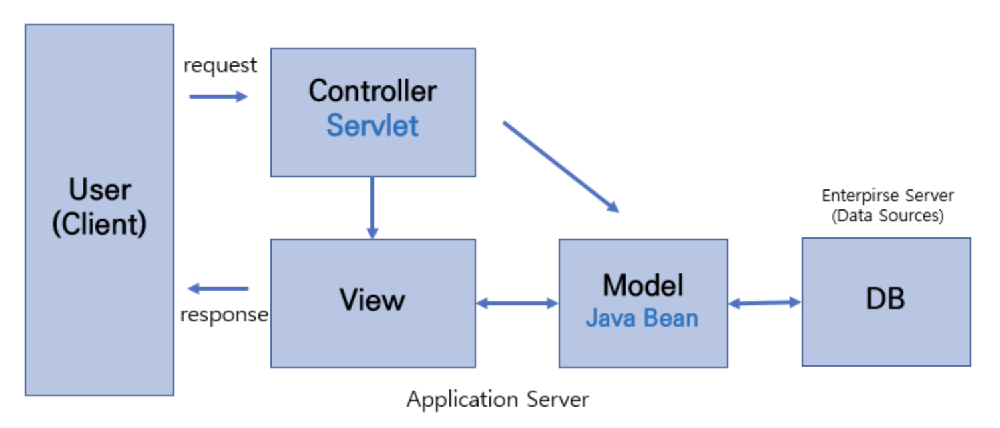
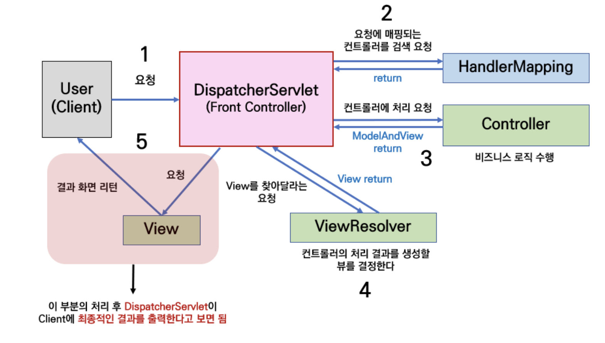
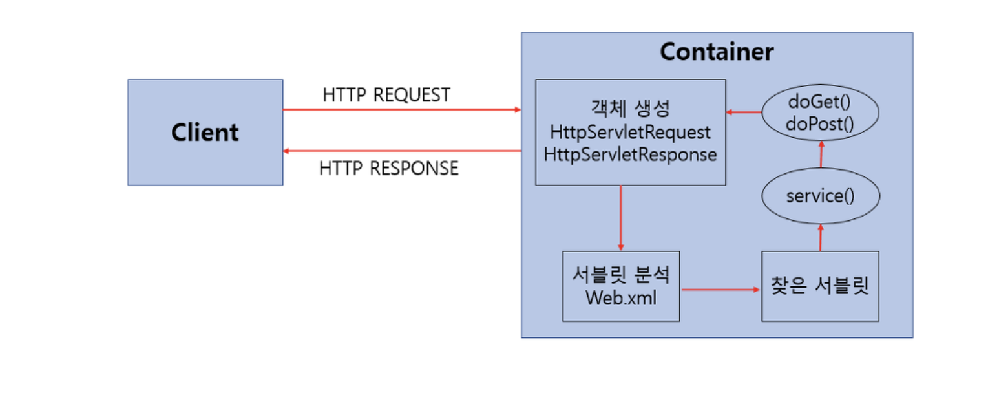

# MVC 패턴 + Servlet vs JSP

# MVC 패턴

- Model, View, Controller
- MVC1, MVC2
    - 클라이언트의 요청 사항을 모듈화 되지 않은 하나의 파일로 처리할 것이냐, 각각의 기능을 담당하는 모듈들이 역할을 분담해서 처리할 것이냐로 결정

### Model

- 애플리케이션의 정보, 데이터의 가공을 책임지며 DB와 상호작용하며 비즈니스 로직을 처리하는 모듈, 컴포넌트
- 사용자가 이용하려는 모든 데이터를 가지고 있어야 함
- View 또는 Controller에 대해 어떤 정보도 알 수 없어야 함
- 변경이 일어나면 처리 방법을 구현해야 함

### View

- 사용자 인터페이스 요소
- Client에게 보여지는 결과화면을 반환하는 모듈
- Model이 가지고 있는 데이터를 저장하면 안 됨
- Model이나 Controller에 대한 정보를 알면 안되며 단순히 표시해주는 역할
- 변경이 일어나면 처리 방법 구현

### Controller

- Model과 View를 연결해주며 제어하는 모듈
- Model 또는 View에 대한 정보를 알아야 함
- Model 또는 View의 변경을 인지하여 대처해야 함

# MVC1 패턴

- **View/Controller(JSP) ↔ Model(Java Bean) ↔ DB**
- web application server에서 모든 파일에 클라이언트가 요청한 로직을 처리하는 경우
- **JSP에서 View, Controller의 역할 담당**
- MVC 패턴에 맞게 model, controller, view 부분으로 모듈화
- 규모 커질 때 유지보수 어려움

# MVC2 패턴

- MVC1을 보완하여 요청을 하나의 Controller가 받는 아키텍처
- **JSP는 로직 처리가 없이 단순히 Client에게 보여지는 View만 담당**
- spring에서 MVC2 패턴
    
    
    

# Servlet vs JSP

> CGI(프로세스 단위) → Servlet/mode php, FastCGI 등(스레드 단위) → JSP
> 

### Servlet

- 자바 기반으로 데이터를 동적으로 멀티스레드 개념을 통해 처리하기 위해 등장한 프로그램
- 자바 코드 속에 HTML
- **MVC 패턴에서 Controller 역할**
- 자바로 구현된 CGI
- Java Thread를 이용하여 동작
- HTML 변경시 재컴파일해야 하는 단점

### JSP (Java Server Page)

- HTML 속에 자바  코드 들어가는 구조의 스크립트 언어
    - `<% source %>` || `<%= source =%>`
- 웹 서버에서 실행됨 (WAS에서 자동으로 빌드하고 클라이언트 화면에 동적으로 보여줌)
- **MVC 패턴에서 View 역할**

### Servlet 동작 방식 (+ Life Cycle)

1. HTTP Request Servlet Container로 전송
2. Servlet Container는 `HttpServletRequest`, `HttpServletResponse` 객체 생성
3. Servlet 분석 (Web.xml)
4. 찾은 Servlet → service() → doGet(), doPost()가 동적 페이지 생성 후 `HttpServletResponse`으로 Response

### JSP 동작 방식

1. JSP .jsp 파일 → Servlet .java 파일로 변환
2. 컴파일하여 .class 파일 생성
3. 실행 결과 자바 언어 사라진 html 변환되어 유저에게 전달

### Servlet Container (서블릿 컨테이너)

- Servlet을 관리하는 컨테이너
- 웹서버와의 통신 지원
- Servlet Life Cycle 관리
- 멀티 스레드 지원 및 관리
- 선언적인 보안 관리
