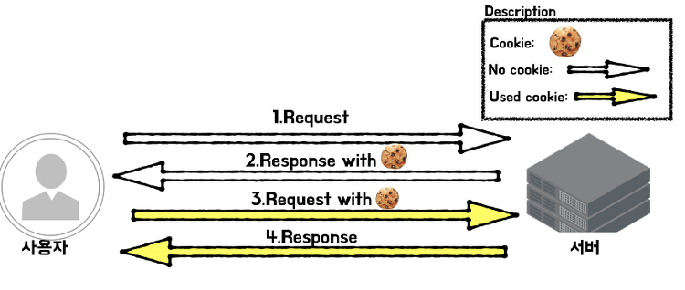
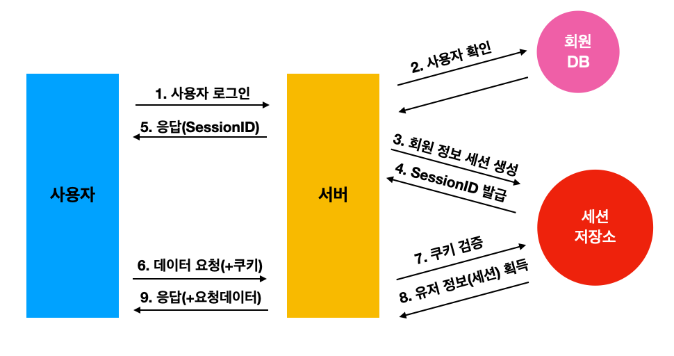
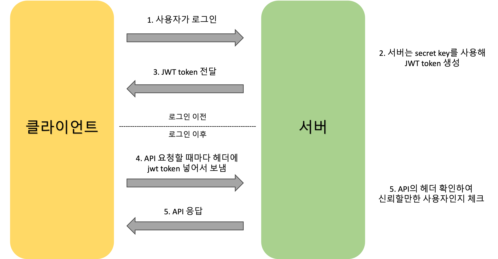

### 쿠키, 세션, JWT

**등장 배경**

- http 통신은 `stateless(상태 유지 x)` 하다는 특징이 있음 → 상태를 저장하기 위해 쿠키, 세션, 토큰을 사용함

**쿠키**

- 클라이언트 측에 정보를 저장함
- 동작 방식
    1. 서버가 응답 헤더의 Set-Cookie에 저장할 정보를 담아서 보냄
    2. 클라이언트는 요청 전송 시 쿠키를 헤더에 담아서 전송
- 요청 시 쿠키값을 그대로 보내기 때문에 보안에 취약함 

**세션**
- 쿠키를 이용하는 방식이 보안의 위험이 있음

  → 비밀번호 등 중요한 정보는 서버 측에 저장하는 세션 방식 활용

- 동작 방식
    1. 로그인 성공 시 서버에서 세션 id 발급, 클라이언트에게 전송
    2. 클라이언트는 헤더에 세션 id를 담아 요청을 보냄
    3. 서버에서 세션 id를 검증 후 데이터 전송
- 세션 id에는 정보가 담겨있지 않지만, 세션 id 자체를 탈취하여 클라이언트인 척 할 수 있다는 단점 존재
- 서버 측에 정보를 저장하므로 서버의 부하가 심해질 수 있음 

**JWT(Json Web Token)**

- 토큰 인증
    - 클라이언트 측에 저장하는 방식
    - 동작 방식
        1. 로그인에 성공하면 서버가 클라이언트에게 토큰 발급
        2. 클라이언트는 서버에 요청 전송 시 토큰과 같이 보냄
    - 서버에 별도의 저장소가 필요 없음
    - 쿠키/세션에 비해서 토큰 자체의 길이가 길어 네트워크 부하가 심해질 수 있음
    - 토큰을 탈취당하면 대처하기가 어려움

      → 토큰 만료 기한을 짧게 설정하거나, acces token/refresh token 을 따로 발급하는 방법으로 해결

- header, payload, signature 로 구성
    - header : 사용한 알고리즘과 키 값을 담고 있음
    - payload : 데이터들
    - signature : 서명, 토큰이 위변조되었는지 알 수 있음

