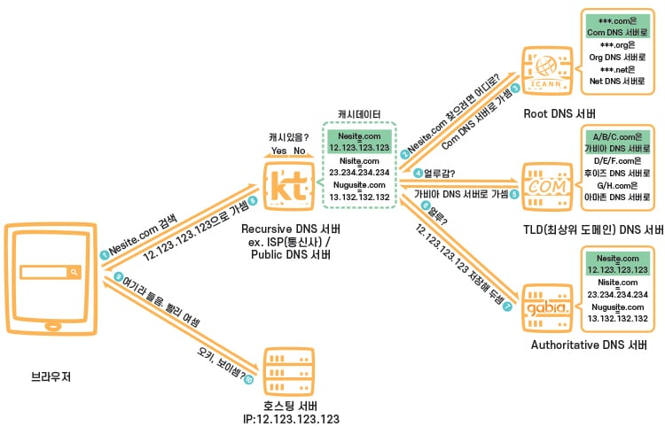
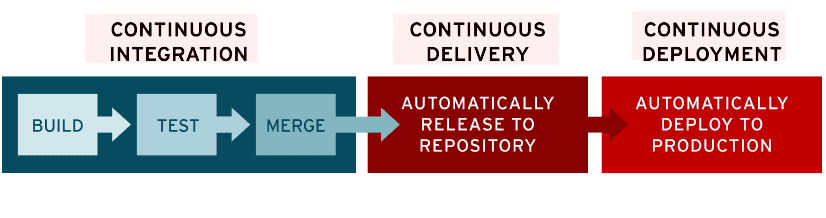

### 인프라

**인프라란**

- 데이터를 주고받기 위한 물리적 장비
- 개발이나 서비스를 하기 위에 물리적으로 구성된 Network, DB, Server, Cloud 등
- 크게 하드웨어, 소프트웨어, 네트워킹으로 구분됨

**HTTPS**

- HTTP의 암호화 버전
- HTTP 요청/응답에서는 일반 텍스트로 전송이 되기 때문에 모든 사람이 내용을 읽을 수 있음 → 보안에 약함
  → HTTPS에서는 TLS/SSL을 사용하여 요청과 응답을 암호화함

**DNS(Domain Name System) 서버**

- 도메인 주소를 ip 주소로 변할 수 있게 해주는 역할
- 도메인 이름과 해당 IP 주소의 데이터베이스를 유지 관리
- 동작 방식
  1. 웹 브라우저에 도메인 주소 입력
  1. 컴퓨터는 ip 주소를 얻기 위해 도메인 서버에 요청을 보냄
  1. DNS 서버는 데이터베이스 검색 또는 다른 DNS 서버에 연결하여 해당 도메인 이름과 연결된 ip 주소를 찾음
  1. ip 주소를 찾으면 컴퓨터로 반환
  1. 해당 웹사이트에 연결 가능
- DNS 서버를 이용하면 복잡한 ip 주소 대신 간단한 도메인 이름만 기억하면 됨

**CI/CD**

- 개발을 하고 서비스를 배포하기까지는 개발, 테스트, 빌드, 배포 등의 많은 과정이 필요함, 이런 과정을 자동화시키는 것
- CI(Continuous Integration)
  - 빌드, 테스트 자동화
  - 코드의 변경 사항이 있을 경우 정기적으로 빌드, 테스트되어 통합됨
- CD(Continuous Deployment or Continuous Delivery)
  - 배포의 자동화
  - `Continuous Delivery(지속적 제공)` 은 CI 작업을 거친 후 레포지토리에 자동으로 업로드 되는 것, 이후 검증팀이 업로드된 릴리즈가 문제가 없는지 확인 후 수동으로 배포함
  - `Continuous Deployment(지속적 배포)` 는 사람이 따로 준비된 릴리즈를 확인 x, 배포까지 자동화해두는 것

