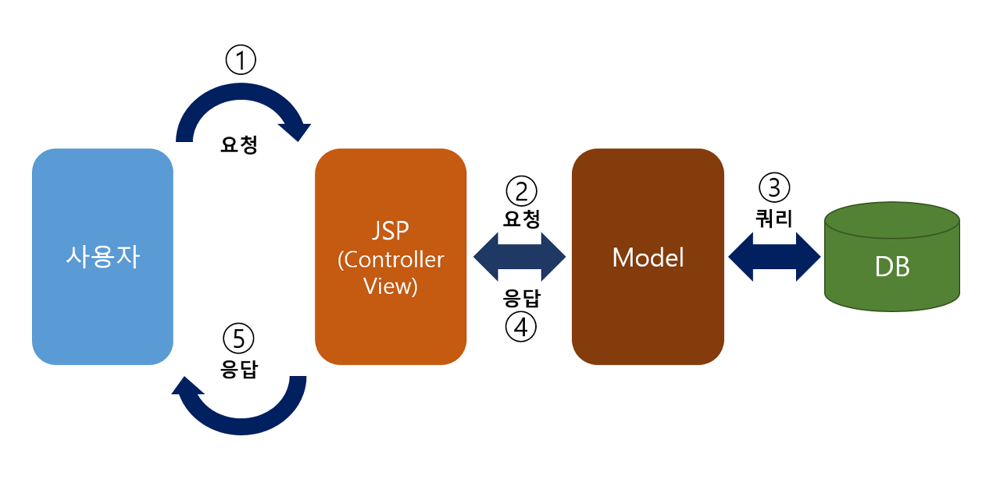
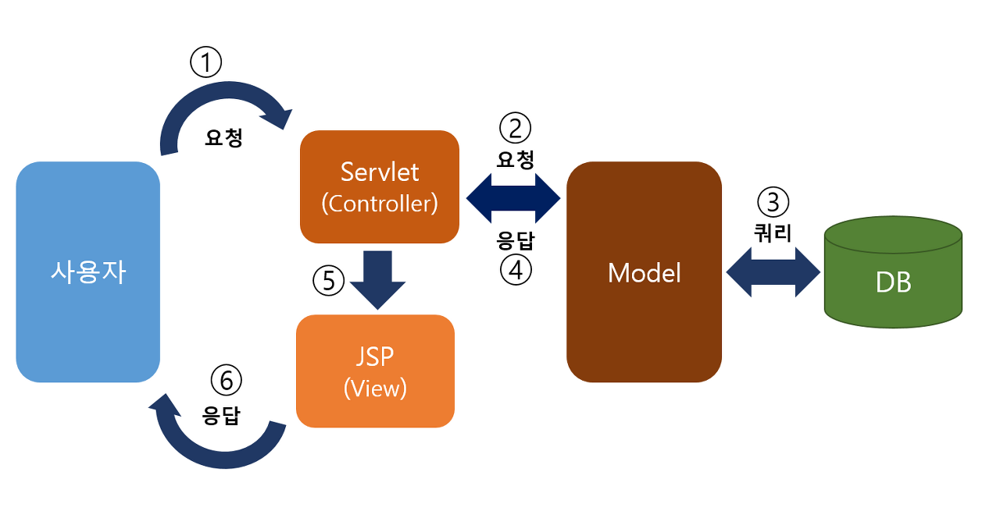

### MVC1, MVC2

**MVC 패턴**

- 디자인 패턴 중 하나
    - 디자인 패턴 : 개발하면서 생기는 반복적인 문제들을 해결하기 위해 고안된 해결 방안
- `Model, View, Controller` 로 구성
    - `Model` : 애플리케이션의 정보, 데이터
    - `View` : 사용자에게 보여지는 화면, UI
    - `Controller` : 데이터와 사용자 인터페이스 사이의 동작을 관리, 메인 로직 처리

**MVC 모델 1**

- 뷰와 컨트롤러의 역할이 합쳐져 있음
- Jsp 가 뷰와 컨트롤러의 역할을 모두 함

  → Jsp에 java, html, css 등의 코드가 모두 섞여 있어 소스가 복잡함

- 설계가 간단하여 규모가 작은 프로젝트에 알맞음
  

**MVC 모델 2**

- 주로 사용되는 모델
- 모델1의 유지보수가 힘들다는 단점을 보완하기 위해 나온 모델
- 뷰와 컨트롤러가 나누어져 있음
- Jsp는 뷰의 역할만 담당, Servlet이 컨트롤러의 역할 담당
- 초기 설계에 비용이 많이 들지만, 유지보수에 용이함
  
